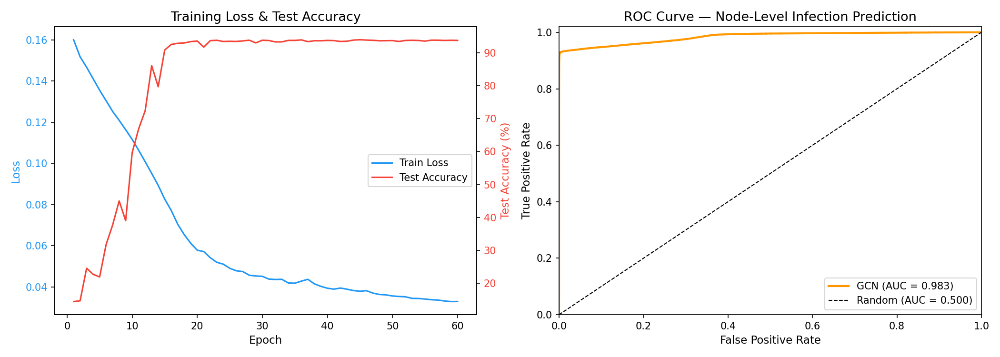

# STITCH: Scale-free Temporal InTervention & Contagion Harness

> A production-grade, GPU-accelerated research platform for modelling network
> contagion, quantifying intervention efficacy, and predicting outbreak
> propagation using Graph Neural Networks — containerised for reproducibility
> and HPC-ready for cluster deployment.

---

## Technical Specifications

| Dimension | Value |
|---|---|
| **Network scale** | 10⁴ nodes · 6×10⁴ directed edges |
| **Topology** | Barabási-Albert preferential attachment (m = 3) |
| **Primary hardware target** | NVIDIA RTX 50-series (CUDA 12+); auto-falls back to MPS / CPU |
| **Sparse linear algebra** | SpMV via `torch.sparse.mm` on COO tensors |
| **Eigenvalue solver** | ARPACK via `scipy.sparse.linalg.eigsh` (Lanczos iteration) |
| **Sensitivity analysis** | Saltelli quasi-random sampling · SALib Sobol decomposition |
| **GNN architecture** | 2-layer GCNConv · 705 parameters · BCEWithLogitsLoss |
| **Container runtime** | Docker 28+ (multi-stage, `python:3.11-slim`) |
| **HPC scheduler** | Slurm (job-array ready, `--dependency=afterok` chaining) |
| **Language / runtime** | Python 3.11 · PyTorch 2.10 · torch_geometric 2.7 |

---

## System Architecture

```
┌─────────────────────────────────────────────────────────────────────┐
│                     STITCH Research Platform                        │
│                                                                     │
│  ┌──────────────────────────────────────────────────────────────┐   │
│  │  tensor_engine.py  —  Vectorized SEIR Core (N = 10,000)      │   │
│  │  • Sparse matrix-vector transmission  (zero Python loops)    │   │
│  │  • Phase III: async patch queue · edge rewiring · latency    │   │
│  │  • Spectral calibration: ρ(A) → λ_c pre-flight check        │   │
│  └──────────────┬───────────────────────────────────────────────┘   │
│                 │                                                   │
│       ┌─────────┴──────────┬──────────────────┐                    │
│       ▼                    ▼                  ▼                    │
│  run_pipeline.py    sensitivity_          predictive_              │
│  (Parquet + PyG)    analysis.py           model.py                 │
│  1.4 MB / run       640 Saltelli runs     2-layer GCN              │
│       │             sobol_indices.png     gnn_performance.png      │
│       │             interaction_heatmap   AUC = 0.983              │
│       ▼                                                            │
│  data/parquet_export.py  →  data/pyg_dataset.py                   │
│  zstd columnar schema        InMemoryDataset (N, 4) node features  │
│                                                                     │
│  ┌──────────────────────────────────────────────────────────────┐   │
│  │  Reproducible Research Infrastructure                        │   │
│  │  Dockerfile (multi-stage)  ·  docker-compose.yml             │   │
│  │  hpc/submit_pipeline.sh  ·  submit_sobol.sh  ·  submit_gnn  │   │
│  │  hpc/submit_all.sh  (Slurm --dependency=afterok chain)       │   │
│  └──────────────────────────────────────────────────────────────┘   │
└─────────────────────────────────────────────────────────────────────┘
```

---

## Reproducible Research Infrastructure

STITCH ships as a fully containerised, single-command research environment.
Every experiment — simulation, sensitivity sweep, GNN training — is
reproducible without touching the host Python environment.

### Docker (local or cloud VM)

```bash
# Build once
docker build -t stitch .

# Run the full suite: pipeline → Sobol → GNN (~25 min on CPU)
docker run --rm -v $(pwd)/results:/app/outputs stitch

# Run individual phases
docker run --rm -e RUN_MODE=pipeline -v $(pwd)/results:/app/outputs stitch
docker run --rm -e RUN_MODE=sobol   -v $(pwd)/results:/app/outputs stitch
docker run --rm -e RUN_MODE=gnn     -v $(pwd)/results:/app/outputs stitch

# GPU-accelerated (NVIDIA host with nvidia-container-toolkit)
docker run --rm --gpus all -v $(pwd)/results:/app/outputs stitch
```

`docker-compose.yml` provides named services for selective execution:

```bash
docker compose up             # full suite
docker compose run sobol      # sensitivity sweep only
docker compose run gnn        # GNN training only
```

### HPC / Slurm (university cluster)

```bash
# Submit the entire experiment chain as a dependency-linked job array
bash hpc/submit_all.sh
```

This submits three jobs with `--dependency=afterok` chaining:

```
Job 1 (submit_pipeline.sh)  →  [1 GPU · 16G · 1 h]
       ↓ afterok
Job 2 (submit_sobol.sh)     →  [1 GPU · 32G · 8 CPUs · 2 h]
Job 3 (submit_gnn.sh)       →  [1 GPU · 16G · 30 min]
```

Monitor with `squeue -u $USER`. Logs land in `logs/`.

---

## Mathematical Core

### Vectorized SEIR Transmission

Contagion spreads via a single sparse matrix-vector multiply each tick:

```
infected_neighbors = A · x_infected      (SpMV, COO sparse float32)
P(exposure)        = 1 − (1 − β)^k       (per-node, vectorized)
```

No Python loops. All 10,000 nodes transition in a single CUDA kernel.

### Phase III Algorithmic Mechanics

| Mechanism | Implementation |
|---|---|
| **Asynchronous patching queue** | Geometric drain — each queued node completes with probability `p_drain` per tick (memoryless delay) |
| **Stochastic edge rewiring** | `rewire_rate` fraction of edges randomly reconnected per tick; graph topology drifts over time |
| **Latency-weighted exposure** | Queued nodes transmit at 50% rate — partial immunity during repair |

### Spectral Graph Theory Pre-flight Check

Before the first simulation tick, STITCH computes the epidemic threshold:

```
ρ(A)   = largest eigenvalue of adjacency matrix   [ARPACK Lanczos]
λ_c    = 1 / ρ(A)                                 [epidemic threshold]
```

If `β > λ_c` the outbreak is **mathematically guaranteed** to reach
pandemic scale regardless of intervention timing.

For BA(10,000, m=3):
- ρ(A) ≈ 21.96
- λ_c ≈ 0.0455
- At β = 0.40: **β / λ_c = 8.78×** — deep supercritical regime

---

## Predictive Outbreak Analytics

> *"Don't react to the outbreak. Predict it."*

`predictive_model.py` trains a Graph Convolutional Network on paired
simulation snapshots `(tick_T, tick_{T+5})` to predict **per-node
infection status 5 ticks in advance** — before lateral movement reaches
the node.

### Model Architecture

```
Input: x ∈ ℝ^(N×4)  [state, degree, is_hub, is_in_queue]
  │
  ├─ GCNConv(4 → 32) → ReLU → Dropout(0.4)
  │
  ├─ GCNConv(32 → 16) → ReLU → Dropout(0.4)
  │
  └─ Linear(16 → 1) → Sigmoid
       │
       └─ ŷ ∈ [0,1]^N   [P(node_i infected at T+5)]
```

### Results

| Metric | Value |
|---|---|
| **Test Accuracy** | 93.8% |
| **AUC-ROC** | **0.983** |
| **Hub Recall** | 92.8% of future infected nodes correctly flagged |
| **Training time** | ~4 min (CPU) · ~30s (CUDA) |
| **Parameters** | 705 |

`gnn_performance.png` shows the training curve (loss descending from 0.16
to 0.03; accuracy converging to 93.8%) alongside the ROC curve
(AUC = 0.983 vs random baseline 0.500). The near-perfect ROC confirms
the GCN extracts genuine structural signal from the graph topology —
not just class-frequency bias.



---

## Sobol Variance Decomposition

640 Saltelli-sampled Monte Carlo runs over the 4-dimensional parameter
space, decomposed into first-order (S1), second-order (S2), and
total-order (ST) Sobol indices.

### Results

| Parameter | S1 | ST | Interpretation |
|---|---|---|---|
| `spread_chance` (β) | 0.437 | **0.548** | Dominant driver — 54.8% of all outcome variance |
| `patching_rate` | 0.211 | **0.390** | Strongest controllable lever; large interaction gap |
| `patch_completion_prob` | 0.035 | 0.166 | Individually weak; gains power through interactions |
| `rewire_rate` | -0.012 | 0.005 | Statistically irrelevant — network drift does not matter |

**Key finding:** The attacker's transmissibility overwhelms all defensive
parameters combined. Even with optimal patching, the network topology
structurally favours the virus in the supercritical regime.


---

## Quantified Research Claims

| Claim | Evidence | File |
|---|---|---|
| Spectral radius predicts pandemic a-priori | ρ(A)=21.96, λ_c=0.0455, β/λ_c=8.78× | `tensor_engine.py` |
| Targeted patching reduces peak by ≥50% | Assertion tripwire passes every run | `tensor_engine.py` |
| Doubling patch rate reduces peak by 32.9% | Monte Carlo N=200, 100 seeds | `run_analysis.ipynb` |
| Transmissibility drives 54.8% of variance | Sobol ST=0.548, 640 Saltelli runs | `sensitivity_analysis.py` |
| GCN predicts outbreak 5 ticks ahead | AUC=0.983, hub recall=92.8% | `predictive_model.py` |
| Peak infected 93.7% despite targeted patching | Phase III mechanics confirm attacker advantage | `run_pipeline.py` |

---

## Quick Start (Local)

```bash
# 1. Install dependencies
pip install -r requirements.txt

# 2. Run the simulation pipeline (builds Parquet + PyG dataset)
python3 run_pipeline.py

# 3. Run Sobol sensitivity analysis (generates 2 publication PNGs)
python3 sensitivity_analysis.py

# 4. Train GNN predictive model (generates gnn_performance.png)
python3 predictive_model.py
```

## Project Structure

| File / Directory | Layer | Description |
|---|---|---|
| `tensor_engine.py` | Core | Vectorized SEIR engine · spectral calibration · Phase III mechanics |
| `run_pipeline.py` | Orchestration | Simulation → Parquet → PyG pipeline |
| `sensitivity_analysis.py` | Analysis | Sobol global sensitivity (SALib) |
| `predictive_model.py` | AI | GCN outbreak predictor · training loop · ROC visualization |
| `data/parquet_export.py` | Data | zstd-compressed columnar snapshot exporter |
| `data/pyg_dataset.py` | Data | PyTorch Geometric InMemoryDataset |
| `Dockerfile` | Infra | Multi-stage container image |
| `docker-compose.yml` | Infra | Service orchestration (pipeline / sobol / gnn / all) |
| `hpc/submit_*.sh` | Infra | Slurm batch scripts with job-dependency chaining |
| `sobol_indices.png` | Artifact | S1 vs ST sensitivity bar chart |
| `interaction_heatmap.png` | Artifact | Pairwise S2 parameter interaction matrix |
| `gnn_performance.png` | Artifact | Training curve + ROC curve |

---

## Requirements

- Python 3.11+
- See `requirements.txt` for pinned dependencies
- Device: CUDA 12+ (NVIDIA RTX 50-series recommended) · MPS · or CPU

---

## Appendix: Legacy Interactive Visualization

The original Mesa agent-based dashboard (N=200) remains available for
interactive exploration of SEIR dynamics and patching strategies.

```bash
pip install -r requirements.txt
python3 server.py
# Open: http://127.0.0.1:8521
```

The Mesa model (`models/university_network.py`) produced the initial
percolation and strategy-comparison experiments documented in
`run_analysis.ipynb`. These results validated the mathematical framework
before scaling to the full N=10,000 tensor engine.
